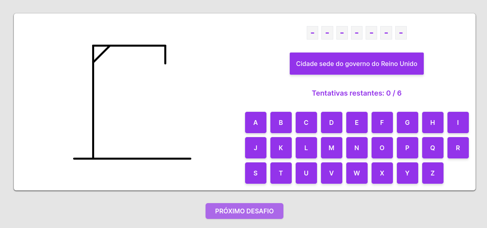

# Jogo-da-Forca-NextJS

Jogo da Forca, utilizando [Next.js](https://nextjs.org/) versão 14.2.3

## Getting Started

Primeiro, execute o servidor de desenvolvimento:

```bash
npm run dev
# ou
yarn dev
# ou
pnpm dev
# ou
bun dev
```

Abra [http://localhost:3000](http://localhost:3000) com seu navegador para ver o resultado.

##


